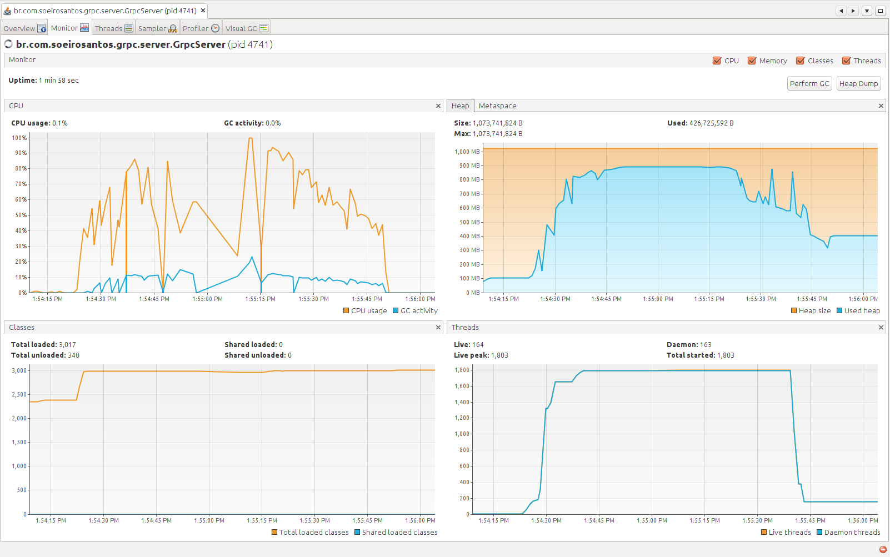
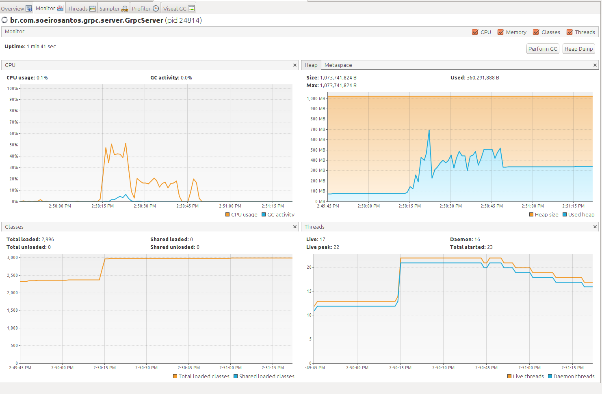

# Tuning a gRPC Server

Before moving forward consider the following:

* If you don't know what gRPC is I'd recommend to take a look at the guide: 
https://grpc.io/docs/guides/index.html
* It's not a benchmark. Don't take the results in absolute terms. It's simply a 
comparison between a "plain" gRPC server using the defaults and one with a few 
configurations.

### Scenario

Check, step by step, the behavior of the configuration and the effects of each 
change under a high throughput scenario, the client is implemented for sending:

> 1,000,000 requests spread over 100 turns, with 200 ms interval and 10,000 concurrent
async calls (using FutureStub).

The service is a simple HelloWorld example with a metadata attached. The service
implementation prints the metadata to the stdout just to put some "traction" 
on the server process.

### Defaults

Following the [examples](https://github.com/grpc/grpc-java/tree/master/examples) we 
can start with something like this:

```java
Server server = ServerBuilder
        .forPort(8080)
        .addService(ServerInterceptors.intercept(new HelloServiceImpl(), new HeaderServerInterceptor()))
        .build();
server.start();
```

Running the client against this setup we can see the following results using [VisualVM](https://visualvm.github.io/):



### Netty Server with custom boss and worker Event Loop Groups.

Following the approach used in the [gRPC java benchmark](https://github.com/grpc/grpc-java/blob/master/benchmarks/src/main/java/io/grpc/benchmarks/qps/AsyncServer.java)
we can switch for a [Netty Server](https://grpc.io/grpc-java/javadoc/io/grpc/netty/NettyServerBuilder.html) 
with custom [boss](https://grpc.io/grpc-java/javadoc/io/grpc/netty/NettyServerBuilder.html#bossEventLoopGroup-io.netty.channel.EventLoopGroup-) 
and [worker](https://grpc.io/grpc-java/javadoc/io/grpc/netty/NettyServerBuilder.html#workerEventLoopGroup-io.netty.channel.EventLoopGroup-) Event Loop Groups.

```java
final EventLoopGroup boss = new NioEventLoopGroup(1, tf);
final EventLoopGroup worker = new NioEventLoopGroup(0, tf);
final Class<? extends ServerChannel> channelType = NioServerSocketChannel.class;

NettyServerBuilder builder = NettyServerBuilder
        .forPort(8080)
        .bossEventLoopGroup(boss)
        .workerEventLoopGroup(worker)
        .channelType(channelType)
        .addService(ServerInterceptors.intercept(new HelloServiceImpl(), new HeaderServerInterceptor()))
        .flowControlWindow(NettyChannelBuilder.DEFAULT_FLOW_CONTROL_WINDOW);
```

The results we get with this configuration aren't  much different from the previous one.

In both cases the futures take long to finish and we loose many requests due 
OutOfMemoryError on the server side.

```
Exception in thread "grpc-default-executor-815" java.lang.OutOfMemoryError: GC overhead limit exceeded
...
Exception in thread "grpc-default-executor-1389" java.lang.OutOfMemoryError: GC overhead limit exceeded
```

### Custom Executor 

With this change we can limit the number of threads delegating the control to the 
[ForkJoinPool executor](https://docs.oracle.com/javase/8/docs/api/java/util/concurrent/ForkJoinPool.html).

```java
private static Executor getAsyncExecutor() {
    return new ForkJoinPool(Runtime.getRuntime().availableProcessors(),
            new ForkJoinPool.ForkJoinWorkerThreadFactory() {
                final AtomicInteger num = new AtomicInteger();

                @Override
                public ForkJoinWorkerThread newThread(ForkJoinPool pool) {
                    ForkJoinWorkerThread thread =
                            ForkJoinPool.defaultForkJoinWorkerThreadFactory.newThread(pool);
                    thread.setDaemon(true);
                    thread.setName("grpc-server-app-" + "-" + num.getAndIncrement());
                    return thread;
                }
            }, UncaughtExceptionHandlers.systemExit(), true);
}

```



A final improvement possible is to increase the size of the young generation, 
which will reduce the number of collections. We can do it by setting 
`-XX:NewRatio=1` - it'll set our young generation for 1/2 of the Heap size.
With this configuration I could notice a reduction of ~70% less collections.

### Hardware and Software used

* Hardware: 32 GB RAM / i7-6700 CPU @ 3.40GHz × 8
* Ubuntu 16.04
* gRPC version 1.11.0
* JVM: OpenJDK 64-Bit Server VM (Zulu 8.28.0.1-linux64) (build 25.163-b01, mixed mode) \ Heap size: -Xms1G -Xmx1G
* [VisualVM](https://visualvm.github.io/) version 1.39